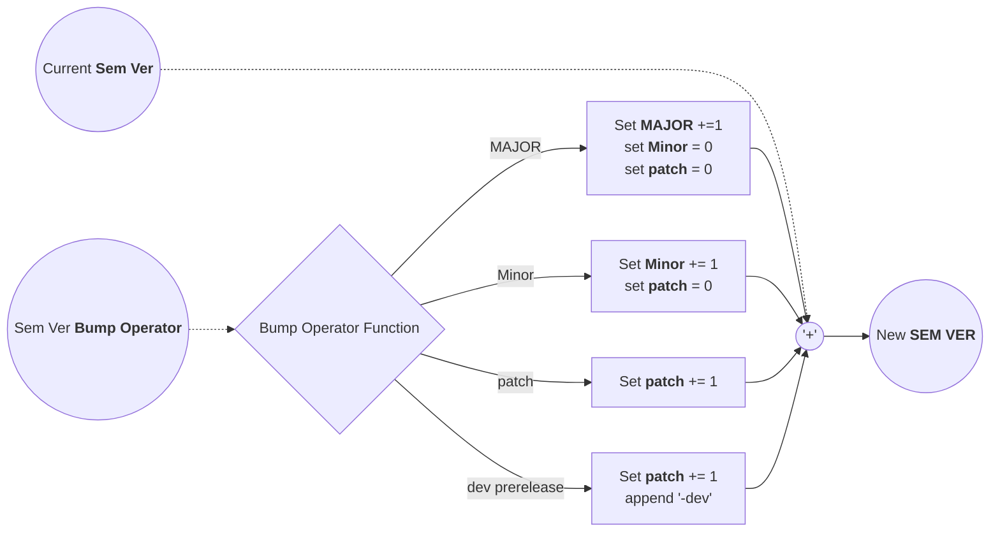

# Semantic Version Bumper

> Bump a Semantic Version based on a given operator.

[](https://github.com/boromir674/action-semver-bumper/actions/workflows/cicd.yml)


[](https://github.com/boromir674/action-semver-bumper/blob/main/LICENSE)





## Inputs

| Input           | Description                                                                 | Required | Default |
|-----------------|-----------------------------------------------------------------------------|----------|---------|
| `sem_ver`       | The current Semantic Version.                                               | `true`   |         |
| `bump_operator` | The bump operator to apply. Valid values are `MAJOR`, `MINOR`, `PATCH`, `DEV_PRERELEASE`. | `true`   |         |

## Outputs

| Output         | Description                                |
|----------------|--------------------------------------------|
| `new_sem_ver`  | The new Semantic Version after applying the bump operator. |

## Usage

```yaml
name: Bump Semantic Version
on: [push]

jobs:
  bump_version:
    runs-on: ubuntu-latest
    steps:
      - name: Checkout repository
        uses: actions/checkout@v4

      - name: Bump Semantic Version
        id: bump_version
        uses: boromir674/action-semver-bumper@v1.0.0
        with:
          sem_ver: '1.0.0'
          bump_operator: 'MINOR'

      - name: Get the new version
        run: echo "New Semantic Version is ${{ steps.bump_version.outputs.new_sem_ver }}"
```

### Example

#### Bumping MAJOR Version

```yaml
- name: Bump Major Version
  id: bump_major
  uses: boromir674/action-semver-bumper@v1.0.0
  with:
    sem_ver: '1.0.0'
    bump_operator: 'MAJOR'
```

#### Bumping Minor Version

```yaml
- name: Bump Minor Version
  id: bump_minor
  uses: boromir674/action-semver-bumper@v1.0.0
  with:
    sem_ver: '1.0.0'
    bump_operator: 'MINOR'
```

#### Bumping Patch Version

```yaml
- name: Bump Patch Version
  id: bump_patch
  uses: boromir674/action-semver-bumper@v1.0.0
  with:
    sem_ver: '1.0.0'
    bump_operator: 'PATCH'
```

#### Bumping with Prerelease Metadata

```yaml
- name: Bump with Dev Prerelease
  id: bump_dev_prerelease
  uses: boromir674/action-semver-bumper@v1.0.0
  with:
    sem_ver: '1.0.0'
    bump_operator: 'DEV_PRERELEASE'
```
