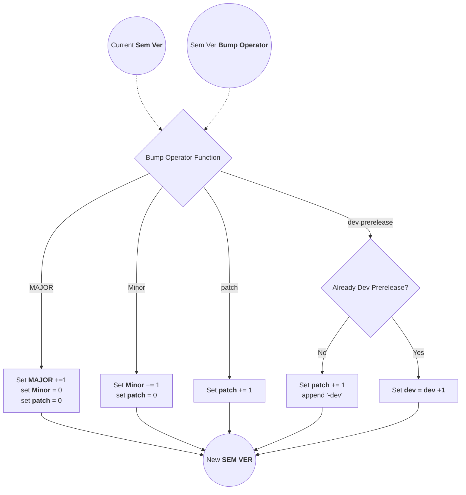

# Semantic Version Bumper

> Bump a Semantic Version based on a given operator.

[](https://github.com/boromir674/action-semver-bumper/actions/workflows/cicd.yml)


[](https://github.com/boromir674/action-semver-bumper/blob/main/LICENSE)

---


```mermaid

graph TB

%% INPUT INFORMATION

INPUT_SEM_VER(("`Current **Sem Ver**`"))
INPUT_SEM_VER_BUMP_OPERATOR(("`Sem Ver **Bump Operator**`"))

%% OUTPUT NODE
NEW_SEM_VER(("`New **SEM VER**`"))

%% CONDITION NODES

COND_SEM_VER_BUMP_OPERATOR{"`Bump Operator Function`"}
COND_ALREADY_DEV_PRERELEASE{"`Already Dev Prerelease?`"}

%% SEM VER BUMP OPERATION

SEM_VER_INCREMENT_MAJOR["`Set **MAJOR** +=1
set **Minor** = 0
set **patch** = 0`"]
SEM_VER_INCREMENT_MINOR["`Set **Minor** += 1
set **patch** = 0`"]
SEM_VER_INCREMENT_PATCH["`Set **patch** += 1`"]
SEM_VER_INCREMENT_PATCH_N_ADD_PRERELEASE_METADATA["`Set **patch** += 1
append '-dev'`"]
SEM_VER_INCREMENT_DEV_PRERELEASE_COUNTER["`Set **dev = dev +1**`"]

%%%% GRAPH DESIGN %%%%

%% INPUT_SEM_VER -...-> APPLY_OPERATOR
INPUT_SEM_VER -.-> COND_SEM_VER_BUMP_OPERATOR
INPUT_SEM_VER_BUMP_OPERATOR -.-> COND_SEM_VER_BUMP_OPERATOR


%% COND_SEM_VER_BUMP_OPERATOR --MAJOR --> COND_STABLE_ALREADY_RELEASED

%% COND_STABLE_ALREADY_RELEASED --No --> SEM_VER_SET_TO_1_0_0
%% COND_STABLE_ALREADY_RELEASED --Yes --> SEM_VER_INCREMENT_MAJOR

%% INPUT_SEM_VER -...-> SEM_VER_INCREMENT_MAJOR
%% INPUT_SEM_VER -...-> SEM_VER_INCREMENT_MINOR
%% INPUT_SEM_VER -...-> SEM_VER_INCREMENT_PATCH
%% INPUT_SEM_VER -...-> SEM_VER_INCREMENT_PATCH_N_ADD_PRERELEASE_METADATA


COND_SEM_VER_BUMP_OPERATOR --MAJOR --> SEM_VER_INCREMENT_MAJOR
COND_SEM_VER_BUMP_OPERATOR --Minor --> SEM_VER_INCREMENT_MINOR
COND_SEM_VER_BUMP_OPERATOR --patch --> SEM_VER_INCREMENT_PATCH
COND_SEM_VER_BUMP_OPERATOR --dev prerelease --> COND_ALREADY_DEV_PRERELEASE
COND_ALREADY_DEV_PRERELEASE --No --> SEM_VER_INCREMENT_PATCH_N_ADD_PRERELEASE_METADATA

COND_ALREADY_DEV_PRERELEASE --Yes --> SEM_VER_INCREMENT_DEV_PRERELEASE_COUNTER


%% APPLY_OPERATOR(("`Current Version + Operator = New Sem Ver`"))
%% INPUT_SEM_VER -..-> APPLY_OPERATOR(("`Current Version + Operator = New 
%% Sem Ver`"))

%% APPLY_OPERATOR("`Apply Operator on
%% Current Version`")

%% APPLY_OPERATOR(("`'+'`"))

%% CONNECT ALL BUMPS to OPERATOR - V1
%% SEM_VER_INCREMENT_MAJOR --> APPLY_OPERATOR
%% SEM_VER_INCREMENT_MINOR --> APPLY_OPERATOR
%% SEM_VER_INCREMENT_PATCH --> APPLY_OPERATOR
%% SEM_VER_INCREMENT_PATCH_N_ADD_PRERELEASE_METADATA --> APPLY_OPERATOR
%% SEM_VER_INCREMENT_DEV_PRERELEASE_COUNTER --> APPLY_OPERATOR
%% APPLY_OPERATOR --> NEW_SEM_VER


%% CONNECT ALL BUMPS to OPERATOR - V1
SEM_VER_INCREMENT_MAJOR --> NEW_SEM_VER
SEM_VER_INCREMENT_MINOR --> NEW_SEM_VER
SEM_VER_INCREMENT_PATCH --> NEW_SEM_VER
SEM_VER_INCREMENT_PATCH_N_ADD_PRERELEASE_METADATA --> NEW_SEM_VER
SEM_VER_INCREMENT_DEV_PRERELEASE_COUNTER --> NEW_SEM_VER

```

## ✨ Features

- This Action acts as a pure Function (same input always yields same output).
- **Does one thing** and does it **well**. Parsing of Conventional Commits, is out of scope!
- **Smart Version Handling**:
  - Properly increments MAJOR, MINOR, and PATCH versions
  - Intelligently handles prerelease versions:
    - When bumping from `1.0.0` to a dev release → `1.0.1-dev`
    - When bumping from `1.0.0-dev` to a higher dev release → `1.0.0-dev1`
- **Case-insensitive Operators** - Use `MAJOR`, `major`, or `Major` as needed

## Inputs

| Input           | Description                                                                 | Required | Default |
|-----------------|-----------------------------------------------------------------------------|----------|---------|
| `sem_ver`       | The current Semantic Version.                                               | `true`   |         |
| `bump_operator` | The bump operator to apply. Valid values are `MAJOR`, `MINOR`, `PATCH`, `DEV_PRERELEASE` (case-insensitive). | `true`   |         |

## Outputs

| Output         | Description                                |
|----------------|--------------------------------------------|
| `new_sem_ver`  | The new Semantic Version after applying the bump operator. |


## 🔄 Bump Operators

This action supports four bump operators:

| Operator | Effect | Example |
|----------|--------|---------|
| `MAJOR` | Increments the MAJOR version, resets MINOR and PATCH to 0 | `1.2.3` → `2.0.0` |
| `MINOR` | Increments the MINOR version, resets PATCH to 0 | `1.2.3` → `1.3.0` |
| `PATCH` | Increments the PATCH version | `1.2.3` → `1.2.4` |
| `DEV_PRERELEASE` | Adds/increments dev prerelease identifier | See notes below |

**Special behavior for `DEV_PRERELEASE`**:
- For regular versions: increments PATCH and adds `-dev` suffix
  - Example: `1.0.0` → `1.0.1-dev`
- For existing dev prereleases: increments only the dev counter
  - Example: `1.0.0-dev` → `1.0.0-dev1`, `1.0.0-dev1` → `1.0.0-dev2`

### Additional Examples

To see more examples of how this logic works, including detailed input and expected output for various operators, refer to the [CI/CD Pipeline configuration](.github/workflows/cicd.yml). This file contains multiple test cases that demonstrate the behavior of the action under different scenarios.


## Usage

```yaml
name: Bump Semantic Version
on: [push]

jobs:
  bump_version:
    runs-on: ubuntu-latest
    steps:
      - name: Checkout repository
        uses: actions/checkout@v5

      - name: Bump Semantic Version
        id: bump_version
        uses: boromir674/action-semver-bumper@v1.1.0
        with:
          sem_ver: '1.1.0'
          bump_operator: 'MINOR'  # Case-insensitive, also accepts 'minor'

      - name: Get the new version
        run: echo "New Semantic Version is ${{ steps.bump_version.outputs.new_sem_ver }}"
```

### Examples

The action supports case-insensitive bump operators, so you can use both uppercase (`MAJOR`) and lowercase (`major`) variants, or even `Major`.

#### Bumping MAJOR Version

```yaml
- name: Bump Major Version
  id: bump_major
  uses: boromir674/action-semver-bumper@v1.1.0
  with:
    sem_ver: '1.0.0'
    bump_operator: 'MAJOR'  # Case-insensitive, also accepts 'major'
```

#### Bumping Minor Version

```yaml
- name: Bump Minor Version
  id: bump_minor
  uses: boromir674/action-semver-bumper@v1.1.0
  with:
    sem_ver: '1.0.0'
    bump_operator: 'Minor'  # Case-insensitive, also accepts 'MINOR'
```

#### Bumping Patch Version

```yaml
- name: Bump Patch Version
  id: bump_patch
  uses: boromir674/action-semver-bumper@v1.1.0
  with:
    sem_ver: '1.0.0'
    bump_operator: 'patch'  # Case-insensitive, also accepts 'PATCH'
```

#### Bumping with Prerelease Metadata

```yaml
- name: Bump with Dev Prerelease
  id: bump_dev_prerelease
  uses: boromir674/action-semver-bumper@v1.1.0
  with:
    sem_ver: '1.0.0'
    bump_operator: 'dev_prerelease'  # Case-insensitive, also accepts 'DEV_PRERELEASE'
```
